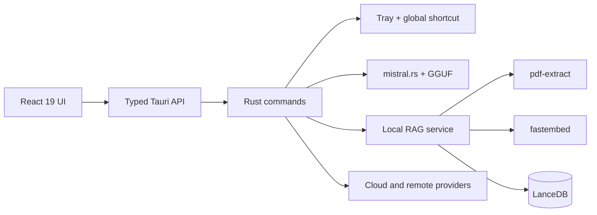

<p align="center">
  
</p>

<h1 align="center">DocuSage Application</h1>

<p align="center">
  <strong>React 19 + TypeScript + Tauri v2 desktop AI for private PDF chat and local RAG.</strong>
</p>

<p align="center">
  <a href="https://waqar-743.github.io/DocuSage/">Website</a>
  &nbsp; | &nbsp;
  <a href="https://github.com/Waqar-743/DocuSage/releases/latest">Windows download</a>
  &nbsp; | &nbsp;
  <a href="https://github.com/Waqar-743/DocuSage">Repository</a>
</p>

## Product preview

<p align="center">
  
</p>

DocuSage launches hidden, waits in the system tray, and opens with `Alt+Space`. It combines local GGUF inference, PDF extraction, local embeddings, LanceDB semantic retrieval, and optional cloud or remote providers in one desktop workspace.

## Application architecture



| Layer | Main files | Responsibility |
| --- | --- | --- |
| Desktop interface | `src/App.tsx`, `src/App.css` | Chat, documents, settings, models, providers, and window modes. |
| Public website | `src/MarketingSite.tsx`, `src/MarketingSite.css` | Responsive SEO-focused product website. |
| Command bridge | `src/lib/api.ts` | Typed calls from React to Rust. |
| Assistant lifecycle | `src-tauri/src/assistant.rs` | Hidden startup, tray menu, shortcuts, close-to-hide, sizing, and focus. |
| App commands | `src-tauri/src/commands.rs` | Chat, model, document, settings, and persistence commands. |
| RAG pipeline | `src-tauri/src/rag.rs` | PDF extraction, chunking, embeddings, LanceDB indexing, and retrieval. |
| Provider layer | `src-tauri/src/providers.rs` | Local, cloud, remote, and compatible API profiles. |
| Tauri setup | `src-tauri/src/lib.rs` | Plugin setup, managed state, and command registration. |

## Development dependencies

- Node.js 18 or newer
- npm
- Rust stable toolchain
- Microsoft C++ Build Tools with Desktop development with C++ on Windows
- WebView2 Runtime
- Git

Install and run:

```bash
npm install
npm run tauri dev
```

Build the web bundle:

```bash
npm run build
```

Build the desktop installer:

```bash
npm run tauri build
```

## Key packages

### Frontend

| Package | Use |
| --- | --- |
| React 19 | Desktop and website component tree |
| TypeScript 5.8 | Frontend type checking |
| Vite 7 | Local development and production build |
| Tailwind CSS 4 | Desktop UI utility styles |
| Lucide React | Interface icons |
| Tauri APIs and plugins | Native desktop bridge, dialogs, and openers |

### Rust

| Crate | Use |
| --- | --- |
| `tauri` 2 | Desktop runtime and tray |
| `mistralrs` 0.7 | Local GGUF inference |
| `lancedb` 0.26 | Local vector database |
| `fastembed` 4 | Local embeddings |
| `pdf-extract` 0.10 | PDF text extraction |
| `tokio` 1 | Async runtime |
| `reqwest` 0.12 | Provider HTTP requests |
| `keyring` 3 | Protected credential storage |

## Source structure

```text
DocuSage/
|-- docs/
|   `-- hidden-assistant-mode.md
|-- public/
|   |-- media/
|   |-- robots.txt
|   `-- sitemap.xml
|-- src/
|   |-- App.tsx
|   |-- App.css
|   |-- MarketingSite.tsx
|   |-- MarketingSite.css
|   |-- main.tsx
|   `-- lib/api.ts
|-- src-tauri/
|   |-- capabilities/
|   |-- icons/
|   |-- src/
|   |   |-- assistant.rs
|   |   |-- commands.rs
|   |   |-- providers.rs
|   |   |-- rag.rs
|   |   |-- lib.rs
|   |   `-- main.rs
|   |-- Cargo.toml
|   `-- tauri.conf.json
|-- index.html
|-- package.json
`-- vite.config.ts
```

## Privacy and provider behavior

Local mode keeps document extraction, embeddings, LanceDB retrieval, prompts, generation, model files, settings, and history on-device.

Provider mode performs retrieval locally first. Only the active prompt, relevant conversation context, and selected document excerpts are sent to the provider chosen in Settings.

Supported profiles include Local, Gemini, OpenAI, Anthropic Claude, OpenRouter, Ollama Local/Remote, LM Studio Local/Remote, and custom OpenAI-compatible endpoints.

## Local model discovery

Place `.gguf` files in `Documents\DocuSage\models\` on Windows or use `src-tauri/.env`:

```env
MODEL_PATH=D:\DocuSage\models
USE_GPU=0
```

## Keyboard behavior

| Shortcut | Action |
| --- | --- |
| `Alt+Space` | Toggle assistant globally |
| `Ctrl+Space` | Fallback global toggle |
| `Escape` | Hide to tray |
| `Ctrl/Cmd + ,` | Open settings |
| `Ctrl/Cmd + N` | New chat |
| `Enter` | Send message |
| `Shift+Enter` | New line |

For the full product story, privacy model, installation guide, and repository map, see the [root README](../README.md).
