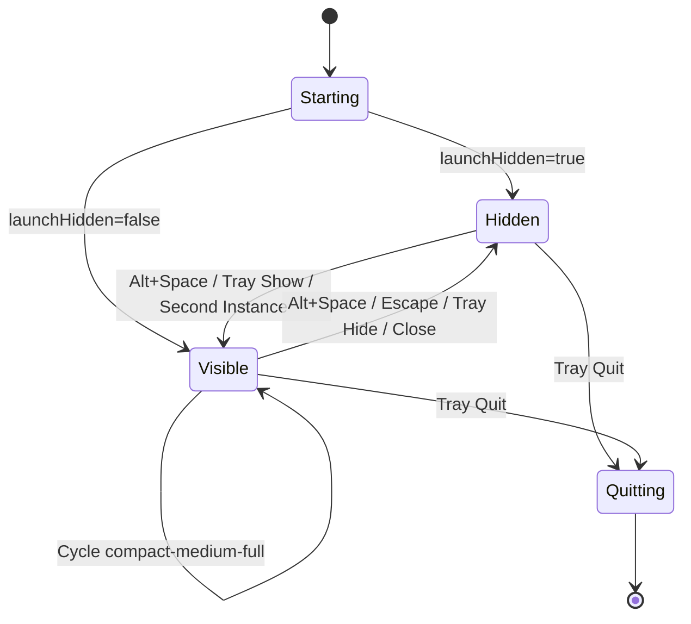
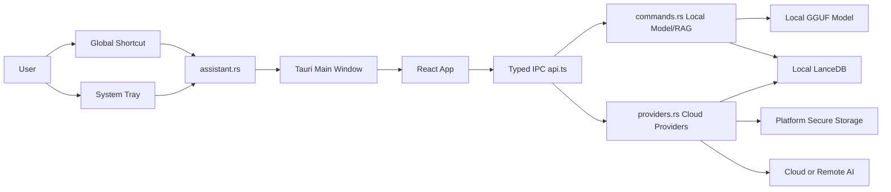
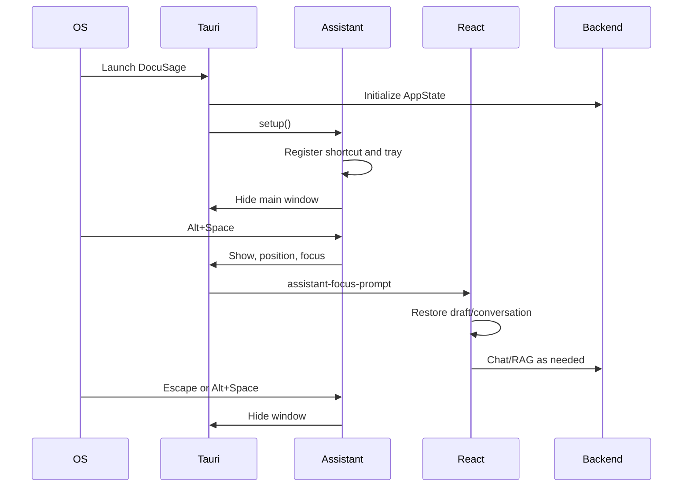
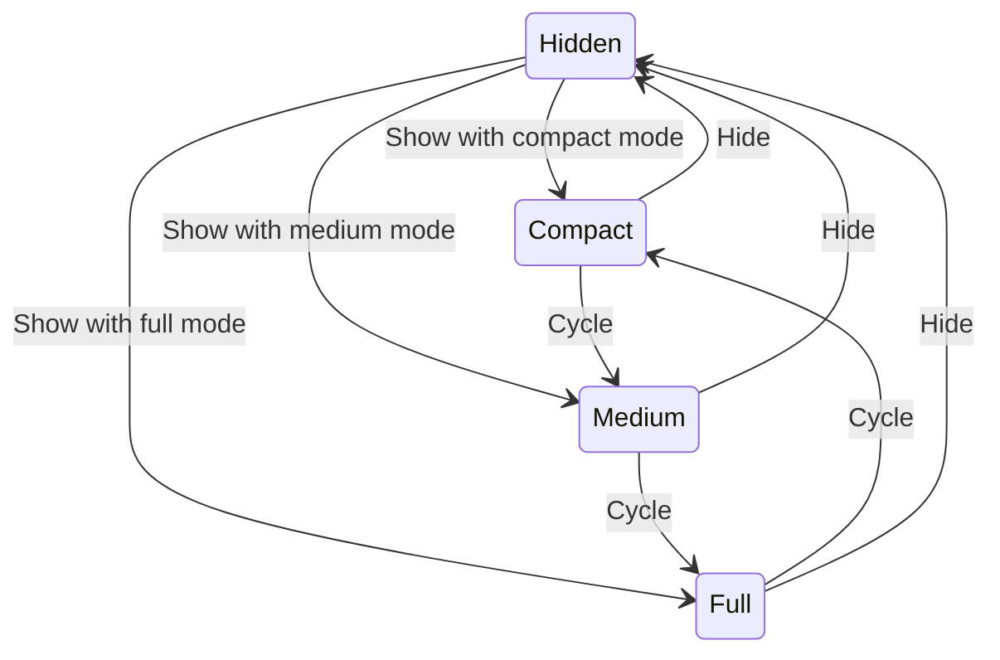
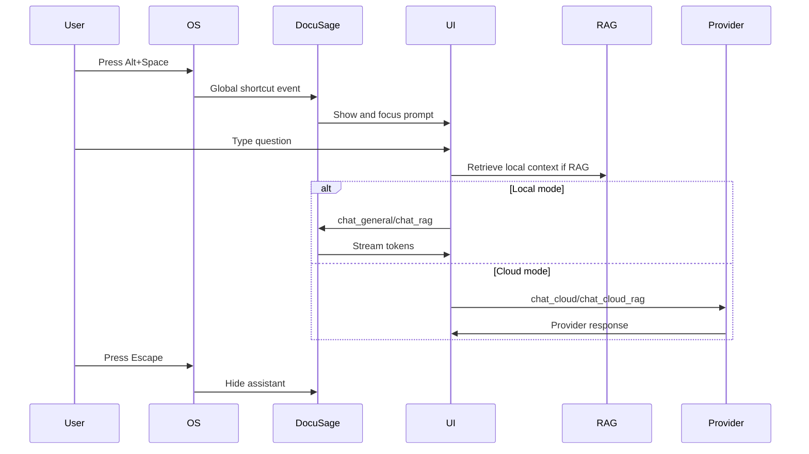

# Hidden Desktop Assistant Mode

## Executive Summary

DocuSage now supports a hidden/background desktop assistant lifecycle. The process can start with no visible window, keep the Rust backend, local model state, embeddings, and LanceDB index available, and toggle the assistant with a global shortcut or tray action.

The implementation is intentionally additive. Existing local GGUF chat, local RAG ingestion, model download/connect/disconnect, and RAG tuning remain in place. The new architecture adds:

- Native global shortcut toggle, default `Alt+Space`.
- System tray actions for show, hide, settings, update check, AI engine restart, and quit.
- Close-to-hide behavior.
- Compact, medium, and full window modes with monitor-aware placement.
- Persistent assistant settings, drafts, scroll positions, active conversation, selected provider, and provider credentials.
- Extensible local/cloud provider system with secure key storage through OS keychain APIs where available.
- Cloud and remote-provider chat paths that reuse local RAG retrieval without moving the local vector database to a provider.

## Architecture Overview

The feature is split into three layers:

- Tauri lifecycle layer: `assistant.rs` manages tray, global shortcut registration, window visibility, geometry, monitor selection, and close-to-hide.
- Provider layer: `providers.rs` manages AI provider configs, active provider selection, secure API key storage, connection tests, and cloud chat/RAG requests.
- React UI layer: `App.tsx` keeps the existing assistant UI, adds compact navigation, assistant settings, provider settings, draft persistence, and activation focus handling.

## Engineering Architecture

New backend modules:

- `src-tauri/src/assistant.rs`
  - Settings file: `assistant-settings.json` under Tauri app config.
  - Runtime debounce for repeated shortcut presses.
  - Tauri tray setup.
  - Global shortcut parser and registration.
  - Smart window sizing and monitor placement.
  - IPC commands for show/hide/toggle/window mode/settings.

- `src-tauri/src/providers.rs`
  - Settings file: `ai-providers.json` under Tauri app config.
  - API keys stored in platform secure storage using `keyring`.
  - Provider CRUD and active-provider selection.
  - Connection tests.
  - Cloud general chat and cloud RAG chat.

Updated backend files:

- `src-tauri/src/lib.rs`
  - Registers `tauri-plugin-global-shortcut`.
  - Registers `tauri-plugin-single-instance`.
  - Installs tray/window lifecycle setup.
  - Adds all assistant and provider commands.

- `src-tauri/src/commands.rs`
  - Adds `restart_ai_engine`.

- `src-tauri/tauri.conf.json`
  - Creates the main window hidden by default.
  - Sets minimum assistant dimensions.
  - Sets skip-taskbar at startup.

Updated frontend files:

- `src/lib/api.ts`
  - Typed IPC wrappers for assistant lifecycle and provider management.
  - Cloud chat wrappers.

- `src/App.tsx`
  - Assistant settings tab.
  - AI provider settings tab.
  - Active provider indicator.
  - Cycle-size button.
  - Compact navigation.
  - Per-conversation draft and scroll persistence.
  - Escape-to-hide and native settings/new-chat shortcuts.

- `src/App.css`
  - Focus-visible support.
  - Reduced motion support.
  - Compact chat constraints.

## UX Strategy

The UI keeps the existing DocuSage look: same colors, typography, spacing, model/RAG settings, and chat surface. Hidden assistant features are exposed as small native-feeling controls:

- Header cycle-size button.
- Provider badge in the header.
- Settings tabs for Assistant and AI Providers.
- Compact mode replaces the sidebar with a dense navigation strip.

Compact mode remains usable by exposing:

- New Chat.
- Ingest PDF.
- Chat/document selection.
- Provider/settings access.
- Existing prompt input.
- Existing messages.
- Existing send/stop action.

## Application Lifecycle Design

Startup:

- Tauri creates the main window hidden.
- Rust initializes `AppState` for local model/RAG.
- Assistant setup loads settings.
- Global shortcut registration is attempted.
- Tray is created.
- If `launchHidden` is true, the window remains hidden and skip-taskbar is applied.
- React loads when the webview is available and hydrates persisted UI/provider settings.

Activation:

- `Alt+Space`, tray click, tray Show Assistant, or second-instance activation calls `show_assistant`.
- The target monitor is chosen.
- Window geometry is applied.
- The window is shown and focused.
- React receives `assistant-focus-prompt` and focuses the prompt.

Hide:

- `Alt+Space`, Escape, tray Hide Assistant, or window close calls hide.
- The window is hidden instead of destroyed.
- Backend state, local model, embeddings, indexing, conversations, drafts, and selected provider remain alive.

Quit:

- Tray Quit calls `app.exit(0)`.
- This is the only tray path that fully terminates the app.

## Window Lifecycle Design

Normal assistant behavior uses `hide/show`; it does not destroy the webview and does not minimize as the primary hidden state. Window close is intercepted and mapped to hide when `hideOnClose` is enabled.

Window modes:

- Compact: around 30-35% screen width with a practical minimum width and a right-side floating position.
- Medium: around 50% screen width and centered.
- Full: near full-screen/maximized on the target monitor without destructive fullscreen.

First activation after install or settings migration forces compact mode once through the native `firstOpenDone` setting. After that, the user's selected window mode is preserved across hide/show and app restarts.

## Window State Machine



## Background Execution Strategy

Rust `AppState` remains process-owned while hidden. The local model stays in memory unless the user disconnects or restarts the engine. The embedding model is cached by `OnceLock` in the RAG module. Ingestion already runs on a blocking worker and is not tied to window visibility.

## Window Positioning Strategy

Placement uses this priority:

1. Monitor containing the cursor.
2. Previously used monitor name.
3. Primary monitor.
4. First available monitor.

Geometry uses physical monitor bounds and scale factor to handle DPI. Compact mode is bottom-right with safe padding. Medium is centered. Full is near full-screen/maximized after positioning.

Invalid state handling:

- Missing monitor falls back to primary/first available.
- Window size is clamped to practical minimums and monitor bounds.
- Repeated activation is debounced.

## Global Shortcut Strategy

Default shortcut: `Alt+Space`.

Implementation:

- Uses `tauri-plugin-global-shortcut`.
- Registers during assistant setup.
- Settings can save a replacement shortcut string.
- Registration failure is emitted to React as `assistant-shortcut-error`.
- If the configured shortcut cannot be registered during startup, DocuSage attempts `Ctrl+Space` as a fallback and writes the active fallback shortcut to assistant settings.

Limitations:

- OS-reserved shortcuts cannot be intercepted.
- Some Linux desktop environments and Wayland compositors restrict global shortcuts.
- Windows commonly reserves `Alt+Space` for the active window system menu; registration may fail or behave differently on some systems.
- macOS may require accessibility/input-monitoring permissions depending on OS policy and packaging.

## System Tray Implementation

Tray actions:

- Show Assistant.
- Hide Assistant.
- Settings.
- Check for Updates.
- Restart AI Engine.
- Quit.

Left-click toggles the assistant. Quit is explicit and exits the process. Settings shows the assistant and opens Settings.

## Multi-Monitor Behavior

The assistant appears on the cursor monitor when possible. If the cursor monitor cannot be detected, the previously used monitor name is used. If the monitor has disconnected, the primary monitor is used.

## Cloud Provider Management

Supported provider kinds:

- Local.
- OpenAI.
- Anthropic.
- Google Gemini.
- OpenRouter.
- Ollama remote.
- LM Studio remote.
- Custom OpenAI-compatible API.

Provider configs include:

- API key.
- Base URL.
- Model.
- Organization/project.
- Timeout.
- Temperature.
- Provider-specific options placeholder.

API keys:

- Stored through the `keyring` crate using platform-native secure storage where available.
- Never written to the provider JSON file.
- Masked by default in the UI.
- Can be shown, replaced, or deleted.

## RAG and Privacy Strategy

Local document ingestion and vector search remain local. Cloud RAG sends only:

- The user prompt.
- Relevant excerpts retrieved from local LanceDB.
- Conversation history passed by the UI.

It does not upload the local vector DB or raw document collection. Local mode continues to use the existing GGUF model path.

## Performance Strategy

Startup:

- Hidden window startup avoids immediate user-facing layout work.
- Model loading remains lazy from the existing React startup path.
- Assistant activation reuses the live process.

Idle:

- Hidden mode does not run a duplicate process.
- RAG embeddings are cached with `OnceLock`.
- Local model remains loaded only when configured and connected.

Activation:

- Geometry is calculated natively.
- React receives a prompt-focus event instead of remounting.
- Drafts and conversations are already in memory.

Installer size:

- Unused frontend public logos were removed from `public/` so Vite no longer copies them into `dist`.
- GGUF models remain externally managed or downloaded into app data, not bundled by default.
- Production frontend build is used. Current frontend output is about 332 KB uncompressed (`index.html`, one CSS asset, one JS asset).
- No duplicate model assets are introduced.

## Accessibility Strategy

- Prompt focuses on activation.
- Escape hides the assistant.
- Ctrl/Cmd+N starts a new chat.
- Ctrl/Cmd+, opens settings.
- Ctrl/Cmd+Enter sends from the prompt.
- Focus-visible styles are explicit.
- Reduced motion is respected.
- Compact mode exposes controls without relying on hover-only UI.
- Native controls are used for selects, inputs, checkboxes, and buttons.

## Cross-Platform Analysis

Windows:

- Hidden windows disappear from Alt+Tab.
- `set_skip_taskbar` is best-effort for taskbar presence.
- `Alt+Space` may conflict with the focused app/system menu.
- Foreground focus can be denied in some elevated/fullscreen cases.

macOS:

- Hidden windows do not appear in normal window cycling.
- Dock/Cmd+Tab behavior is app-level; accessory activation policy may be needed for a fully menu-bar-style app.
- Global shortcuts can require OS permissions depending on packaging and user settings.

Linux:

- X11 global shortcuts are generally supported.
- Wayland support varies by compositor.
- Tray support varies by desktop environment.
- Focus stealing prevention can block activation over fullscreen apps.

## Tauri v2 APIs and Plugins

Used:

- `tauri::Builder::setup`
- `tauri::Builder::on_window_event`
- `tauri::Manager`
- `WebviewWindow::hide/show/set_focus/set_size/set_position/maximize/unmaximize`
- `Window::set_skip_taskbar`
- `TrayIconBuilder`
- `Menu` and `MenuItem`
- `tauri-plugin-global-shortcut`
- `tauri-plugin-single-instance`

## Risks and Trade-Offs

- `Alt+Space` can conflict with native OS/window manager behavior.
- Secure key storage depends on platform keychain availability.
- Cloud providers are not streamed yet; local chat remains streamed.
- macOS Dock hiding may need a packaging-level activation policy if a true accessory app experience is required.
- Rust compilation could not be verified in this shell because `cargo` is unavailable.

## Edge Case Handling

- Multiple instances: second instance shows/focuses the existing assistant.
- Shortcut conflict: registration failure is surfaced in UI.
- Fast repeated shortcuts: native toggle is debounced.
- Window close: hidden to tray by default.
- User quits: tray Quit terminates the app.
- Backend unavailable/model missing: existing model status and errors remain visible.
- AI restart failure: surfaced via toast.
- Monitor disconnect: falls back to primary/first monitor.
- Indexing while hidden: ingestion is backend-owned and continues.
- Cloud provider failure: connection tests and chat calls return provider-specific errors.
- Invalid/missing API key: save/test/chat paths validate and report errors.
- Vector DB unavailable: existing RAG errors are preserved.

## File Organization

```text
src-tauri/src/
  assistant.rs      # Tray, shortcut, lifecycle, window geometry, assistant settings
  providers.rs      # Provider configs, secure keys, tests, cloud chat/RAG
  commands.rs       # Existing model/RAG commands plus restart_ai_engine
  lib.rs            # Tauri builder/plugin/command registration

src/
  App.tsx           # Existing UI plus assistant/provider settings and compact mode
  App.css           # Focus, compact, reduced motion
  lib/api.ts        # Typed IPC wrappers

docs/
  hidden-assistant-mode.md
```

## Phased Roadmap

1. Implement hidden lifecycle, tray, shortcut, and close-to-hide.
2. Add compact/medium/full native window modes and monitor positioning.
3. Persist drafts, scroll, active conversation, and assistant settings.
4. Add provider CRUD and secure API-key storage.
5. Route cloud general/RAG chat through provider adapters.
6. Add provider streaming support.
7. Add packaged updater integration.
8. Add macOS accessory activation policy packaging option.
9. Add platform-specific end-to-end tests.

## Testing Considerations

Manual:

- Launch app and verify no visible window when `launchHidden=true`.
- Press `Alt+Space` to show/hide.
- Close window and confirm app stays in tray.
- Use tray show/hide/settings/restart/quit.
- Cycle compact/medium/full on single and multi-monitor setups.
- Disconnect monitor and activate again.
- Ingest a PDF, hide app during ingestion, then verify completion.
- Save provider key, test connection, switch back to Local, and verify credentials remain saved.

Automated:

- Unit-test shortcut parsing.
- Unit-test provider config validation.
- Unit-test corrupted settings/provider JSON fallback.
- Add Playwright checks for compact layout and prompt focus.
- Add Rust integration tests for provider store key redaction where keychain mocking is available.

## Architecture Diagram



## Application Lifecycle Diagram



## Window State Diagram



## User Interaction Diagram


