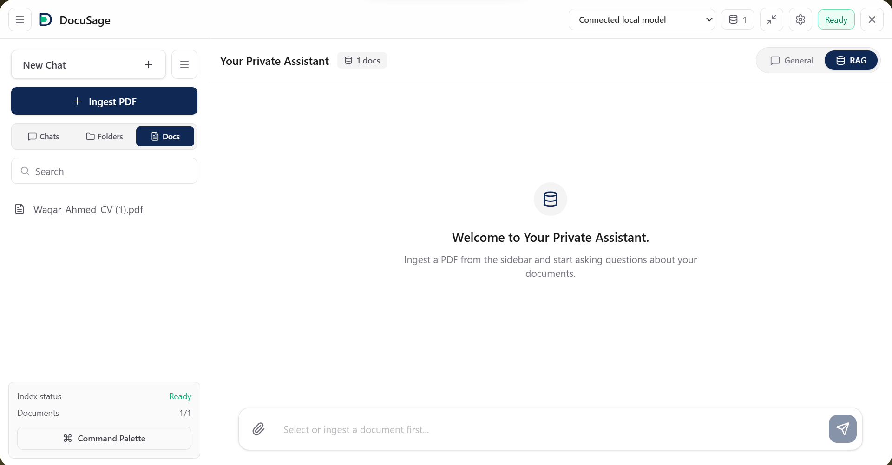
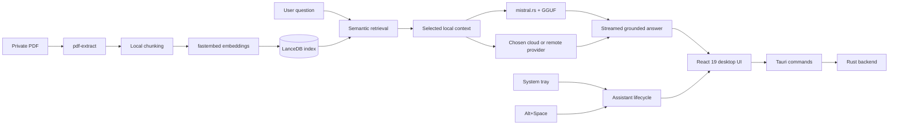

<p align="center">
  
</p>

<h1 align="center">DocuSage</h1>

<p align="center">
  <strong>Private AI PDF chat and local RAG, built for your desktop.</strong><br />
  Search documents locally, chat with offline GGUF models, and call the assistant from anywhere with <code>Alt+Space</code>.
</p>

<p align="center">
  <a href="https://waqar-743.github.io/DocuSage/"><strong>Website</strong></a>
  &nbsp; | &nbsp;
  <a href="https://github.com/Waqar-743/DocuSage/releases/latest"><strong>Download</strong></a>
  &nbsp; | &nbsp;
  <a href="DocuSage/docs/hidden-assistant-mode.md"><strong>Assistant mode</strong></a>
</p>

<p align="center">
  
  
  
  
  
</p>

---

## The idea

DocuSage started with a familiar research problem: the answer was already inside the document, but finding it meant breaking focus, searching across tabs, and often uploading private material to a hosted service.

It is designed as the assistant that stays beside the work instead. DocuSage starts hidden, waits in the system tray, and appears as a compact panel when you press `Alt+Space`. PDF parsing, embeddings, vector retrieval, local model files, and session data remain on your computer. You can use a local GGUF model for a fully offline workflow or deliberately choose a remote provider for final answer generation.

## Current dashboard

<p align="center">
  
</p>

The dashboard brings document ingestion, general chat, RAG mode, model selection, chat history, folders, index status, and assistant controls into one desktop workspace.

## What DocuSage can do

- Ask grounded questions across private PDF documents.
- Parse, chunk, embed, and retrieve document context locally.
- Run offline chat with local GGUF models through `mistral.rs`.
- Store semantic document vectors in a local LanceDB index.
- Launch hidden and toggle the assistant globally with `Alt+Space`.
- Switch between compact, medium, and full window modes.
- Hide to the system tray without losing drafts, sessions, documents, or model state.
- Configure Local, Gemini, OpenAI, Anthropic Claude, OpenRouter, Ollama, LM Studio, and custom OpenAI-compatible providers.
- Keep API credentials in the platform keyring where available.
- Download, connect, disconnect, restart, and remove local models in the app.
- Tune RAG chunk size, overlap, top-k retrieval, and source context display.
- Render streamed Markdown and line-numbered code blocks with copy controls.
- Persist multiple chats, folders, drafts, selected documents, provider choice, sidebar state, and window mode.

## Architecture



### Component map

| Layer | Technology | Responsibility |
| --- | --- | --- |
| Desktop shell | Tauri v2 | Native window, tray, global shortcut, single instance, hidden startup, and installer bundle. |
| Frontend | React 19, TypeScript, Vite | Chat, document controls, settings, provider management, model catalog, RAG controls, and marketing site. |
| Backend | Rust 2021 + Tokio | Tauri commands, streaming, local model lifecycle, persistence, provider requests, and assistant behavior. |
| Local inference | `mistral.rs` | On-device GGUF model execution for offline AI chat. |
| PDF pipeline | `pdf-extract` | Local text extraction before chunking and indexing. |
| Embeddings | `fastembed` + `BAAI/bge-small-en-v1.5` | Local vector generation for document chunks and questions. |
| Vector database | LanceDB | Persistent semantic search across locally ingested PDFs. |
| Provider layer | `reqwest` + platform keyring | Optional cloud/remote inference and protected credential storage. |
| Assistant lifecycle | Tauri tray and global shortcut plugins | Hidden launch, close-to-tray, window modes, focus, and explicit quit. |

## How document Q&A works

1. DocuSage extracts text from the selected PDF on-device.
2. The text is split using the configured chunk size and overlap.
3. `fastembed` creates local vectors for each chunk.
4. LanceDB stores the vectors in a persistent local index.
5. The question is embedded and matched against relevant document chunks.
6. DocuSage sends the selected context to the local GGUF model or the provider you explicitly selected.
7. The grounded answer streams back into the desktop conversation.

## Privacy boundary

Local mode keeps the full pipeline on your computer: documents, extracted text, embeddings, retrieval, prompts, generation, model files, and history.

Provider mode still performs PDF ingestion and semantic retrieval locally. Only the active prompt, conversation context, and selected document excerpts required for synthesis are sent to the configured provider. The full PDF and LanceDB index are not uploaded by the retrieval pipeline.

## Desktop lifecycle

| Event | Behavior |
| --- | --- |
| App launch | Starts hidden, registers the global shortcut, creates the tray menu, and keeps backend services ready. |
| `Alt+Space` while hidden | Opens and focuses the compact assistant panel. |
| `Alt+Space` while visible | Hides the assistant while preserving state. |
| `Escape` or close | Hides the window to the tray instead of quitting. |
| Expand control | Cycles compact -> medium -> full -> compact. |
| Tray Quit | Explicitly stops the app and background services. |

### Keyboard shortcuts

| Shortcut | Action |
| --- | --- |
| `Alt+Space` | Toggle the assistant globally |
| `Ctrl+Space` | Fallback global toggle |
| `Escape` | Hide the assistant |
| `Ctrl/Cmd + ,` | Open settings |
| `Ctrl/Cmd + N` | Start a new chat |
| `Enter` | Send a message |
| `Shift+Enter` | Add a new line |
| `Ctrl+Shift+C` | Clear the current chat |

## Installation

### Download the Windows app

Get the newest installer from [GitHub Releases](https://github.com/Waqar-743/DocuSage/releases/latest). After installation, open DocuSage once and press `Alt+Space` or use the tray icon to show the assistant.

### Build from source

#### Required dependencies

- Windows 10 or Windows 11
- [Node.js 18+](https://nodejs.org/) and npm
- [Rust stable toolchain](https://www.rust-lang.org/tools/install)
- [Microsoft C++ Build Tools](https://visualstudio.microsoft.com/visual-cpp-build-tools/) with Desktop development with C++
- [WebView2 Runtime](https://developer.microsoft.com/microsoft-edge/webview2/) on systems where it is not already installed
- Git
- Enough disk space for local GGUF model files; individual models commonly require 1.5 GB or more

```bash
git clone https://github.com/Waqar-743/DocuSage.git
cd DocuSage/DocuSage
npm install
npm run tauri dev
```

Build a release installer:

```bash
cd DocuSage
npm run tauri build
```

## Local model setup

Use the in-app model catalog or place a `.gguf` file in the default model directory:

| Platform | Default path |
| --- | --- |
| Windows | `Documents\DocuSage\models\` |
| macOS | `~/Documents/DocuSage/models/` |
| Linux | `~/Documents/DocuSage/models/` |

Override model discovery with `DocuSage/src-tauri/.env`:

```env
MODEL_PATH=D:\DocuSage\models
USE_GPU=0
```

## Provider setup

Open **Settings -> AI Providers** to configure and test one of the supported profiles:

- Local
- Google Gemini
- OpenAI
- Anthropic Claude
- OpenRouter
- Ollama Local or Remote
- LM Studio Local or Remote
- Custom OpenAI-compatible API

Each profile can define its model, base URL, timeout, temperature, organization/project metadata, enabled state, and protected API credential.

## Project structure

```text
DocuSage/
|-- .github/workflows/
|   `-- pages.yml                 # GitHub Pages deployment
|-- DocuSage/
|   |-- docs/
|   |   `-- hidden-assistant-mode.md
|   |-- public/
|   |   |-- media/               # Website and README imagery
|   |   |-- robots.txt
|   |   `-- sitemap.xml
|   |-- src/
|   |   |-- App.tsx              # Desktop application interface
|   |   |-- App.css
|   |   |-- MarketingSite.tsx    # Public website
|   |   |-- MarketingSite.css
|   |   |-- main.tsx             # Web/Tauri entry selection
|   |   `-- lib/api.ts           # Typed Tauri command bridge
|   |-- src-tauri/
|   |   |-- capabilities/
|   |   |-- icons/
|   |   |-- src/
|   |   |   |-- assistant.rs     # Tray, shortcuts, and window lifecycle
|   |   |   |-- commands.rs      # App and model Tauri commands
|   |   |   |-- providers.rs     # Provider profiles and remote inference
|   |   |   |-- rag.rs           # PDF, embeddings, and LanceDB pipeline
|   |   |   |-- lib.rs           # Tauri setup and command registration
|   |   |   `-- main.rs
|   |   |-- Cargo.toml
|   |   `-- tauri.conf.json
|   |-- package.json
|   |-- vite.config.ts
|   `-- index.html
|-- README.md
`-- LICENSE
```

## Main dependencies

### Frontend

| Package | Purpose |
| --- | --- |
| React 19 | Desktop and marketing interfaces |
| TypeScript 5.8 | Typed frontend code |
| Vite 7 | Development server and production bundling |
| Tailwind CSS 4 | Utility styling used by the desktop application |
| Lucide React | Interface icon set |
| Tauri JavaScript APIs | Native dialogs, openers, and desktop bridge |

### Rust backend

| Crate | Purpose |
| --- | --- |
| `tauri` 2 | Native desktop runtime and tray support |
| `mistralrs` 0.7 | GGUF local model inference |
| `lancedb` 0.26 | Local vector storage and search |
| `fastembed` 4 | Local text embeddings |
| `pdf-extract` 0.10 | PDF text extraction |
| `tokio` 1 | Async runtime |
| `reqwest` 0.12 | Cloud and remote provider requests |
| `keyring` 3 | Platform-backed credential storage |
| Tauri plugins | Dialog, file system, opener, global shortcut, and single-instance behavior |

## Environment variables

| Variable | Default | Purpose |
| --- | --- | --- |
| `MODEL_PATH` | Auto-detected | Directory containing local `.gguf` files |
| `DOCUSAGE_MODEL_PATH` | Unset | Alternate local model directory override |
| `USE_GPU` | `0` | Enables GPU acceleration where the runtime supports it |
| `CHAT_TEMPLATE` | Auto-detected | Overrides the selected model chat template |
| `TOK_MODEL_ID` | Auto-detected | Overrides tokenizer model discovery |

## Useful commands

```bash
cd DocuSage

npm install          # Install frontend dependencies
npm run dev          # Run the website/browser interface
npm run build        # Type-check and build the web bundle
npm run tauri dev    # Run the desktop app in development
npm run tauri build  # Build the desktop installer
```

## License

DocuSage is released under the [MIT License](LICENSE).
